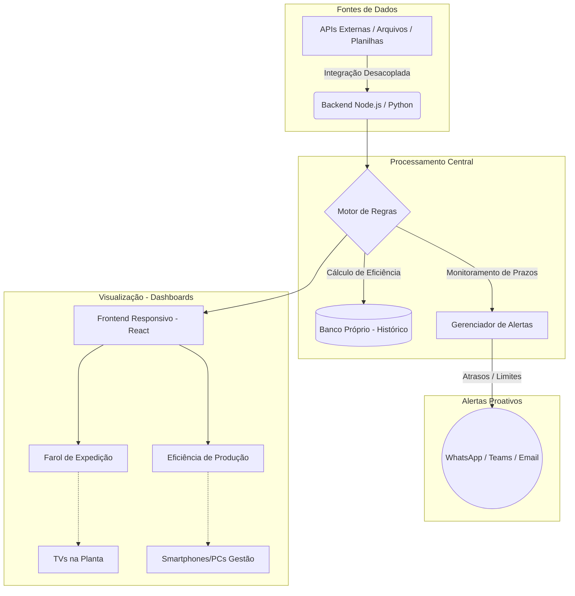

# Resumo da Solução: Dashboard Inteligente de Produção & Expedição

## 1. Objetivo
Desenvolver uma plataforma de monitoramento e gestão em tempo real que traga visibilidade ponta a ponta para as áreas de Produção e Expedição, além de fornecer métricas para a Gestão. A ferramenta é focada em facilitar a tomada de decisão rápida e proativa, projetada desde o início para ser altamente escalável e facilmente implementável em todas as plantas da Regional CNN.

## 2. Como o Sistema Funciona
O sistema é dividido em dois painéis interativos focados em eficiência e cumprimento de prazos.

### Sprint 01: Farol da Expedição
Atua como um radar de saídas diárias, fornecendo:
- **Monitoramento de Prazos:** Lista de clientes e horários planejados de saída, com indicadores visuais de status (🟢 No prazo, 🟡 Próximo do limite, 🔴 Atrasado).
- **Métricas de Progresso:** Contagem em tempo real de clientes expedidos vs. pendentes.
- **Sistema de Alertas:** Notificações proativas (via Teams, WhatsApp, E-mail ou alarmes visuais/sonoros) alertando sobre atrasos iminentes ou cargas não expedidas no fim do turno.
- **Histórico Mensal:** Registro automático de performance por cliente e data para embasar análises e planos de ação.

### Sprint 02: Eficiência da Produção
Painel comparativo entre a entrada e saída da planta:
- **Cálculo de Eficiência:** `(Peso Expedido / Peso Recebido) * 100`.
- **Indicadores Visuais:** Barras de progresso dinâmicas (ex: ████████░░ 94%) e regras de cores (🟢 ≥ 94%, 🔴 < 94%).
- **Detalhamento:** Visão global da planta e visão granular de eficiência por cliente, permitindo identificar gargalos específicos.

**Restrição Importante:** Todo o fluxo de dados operará **sem consultas diretas ao banco do COALA**, utilizando APIs, mensageria ou bancos próprios para garantir o isolamento e performance.

## 3. Tecnologias Propostas (Sugestão de Arquitetura)
Como não podemos acessar o banco do COALA diretamente, a arquitetura deve ser moderna e desacoplada:
- **Frontend (Visualização):** React.js ou Vue.js, garantindo responsividade (TVs nas plantas, Celulares para gestores, PCs para operadores). Tailwind CSS para estilização ágil.
- **Backend (Regras e Alertas):** Node.js ou Python (FastAPI/Flask), processando as lógicas de eficiência e cronogramas.
- **Banco de Dados / Cache:** PostgreSQL para dados históricos e Redis para exibição de dados em tempo real e controle da mensageria dos alertas.
- **Integração / Mensageria:** Webhooks (Teams/WhatsApp) para os alertas e ferramentas de fila (RabbitMQ/Kafka) caso os dados venham de integrações externas em lote.
- **Design & Prototipagem:** Figma, Draw.io ou Microsoft Visio.

## 4. Fluxograma do Sistema

## 5. Por que esta solução deve ganhar o Hackathon?
1. **Impacto Imediato na Operação:** Ataca as dores reais da fábrica (controle de peso e prazos de saída), reduzindo gargalos que custam tempo e dinheiro.
2. **Escalabilidade (Visão de Negócio):** Foi pensada não como uma planilha automatizada, mas como um produto SaaS interno, pronto para ser plugado em qualquer planta da Regional CNN.
3. **Proatividade vs. Reatividade:** O sistema de alertas automáticos tira o operador da tela e permite que a gestão atue antes que o problema estoure.
4. **Independência Tecnológica:** Ao não depender do gargalo técnico/burocrático do banco do COALA, a solução prova que é possível inovar de forma paralela e segura.
5. **Adoção Facilitada (UX):** Uso do padrão universal de cores (Semáforo), interfaces intuitivas e barras de progresso visuais garantem que qualquer colaborador bata o olho e entenda o cenário da planta em segundos.
